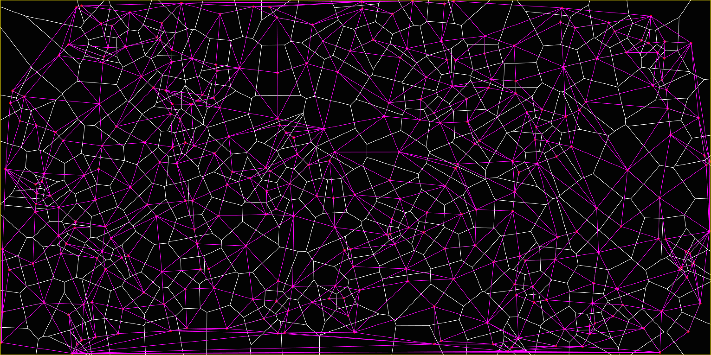

Unity-Delaunay
==============

Voronoi diagrams, Delaunay triangulation, minimum spanning graphs, convex hull and more. Ported to C# for use in the Unity game engine from https://github.com/nodename/as3delaunay.

### Features: ###

 - [Voronoi diagram](http://en.wikipedia.org/wiki/Voronoi)
 - [Delaunay triangulation](http://en.wikipedia.org/wiki/Delaunay_triangulation)
 - [Convex hull](http://en.wikipedia.org/wiki/Convex_hull)
 - [Minimum spanning tree](http://en.wikipedia.org/wiki/Euclidean_minimum_spanning_tree)
 - [Onion](http://cgm.cs.mcgill.ca/~orm/ontri.html)

MIT licensed, like the original.
Check out the original project page [here](http://nodename.github.com/as3delaunay/).